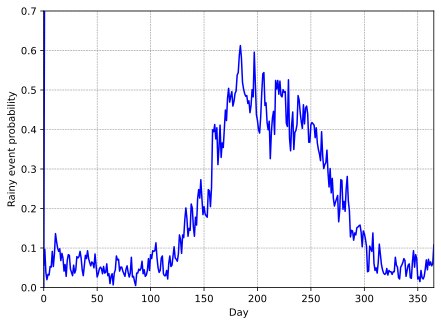
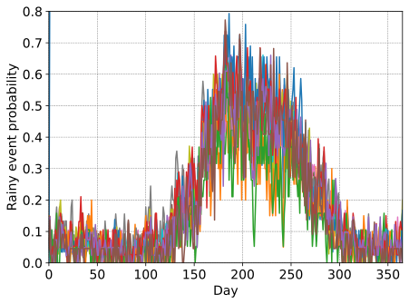
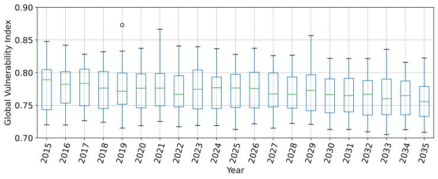
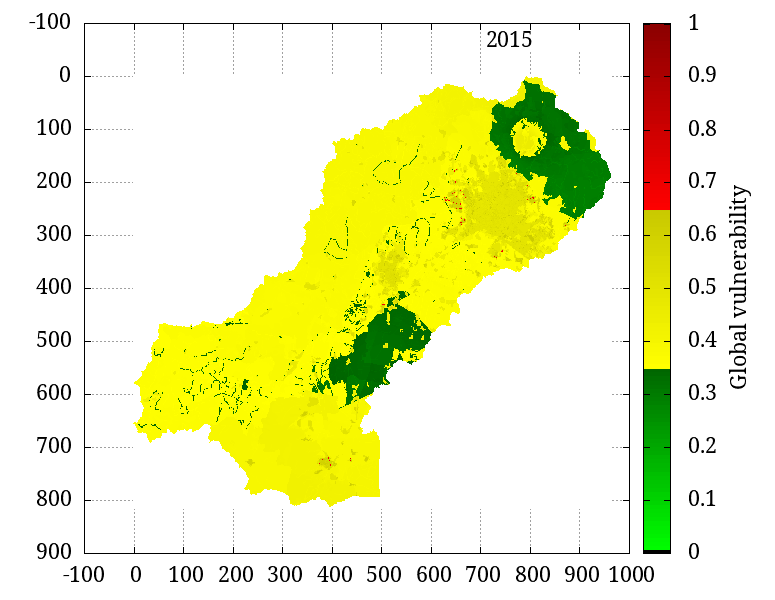
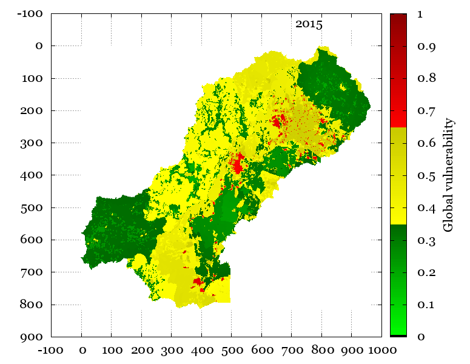
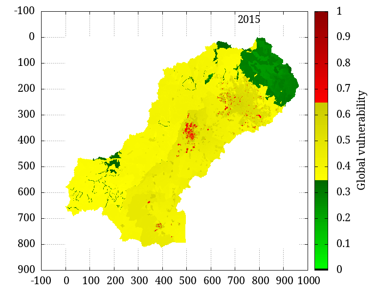

# Robustness of Distributed Vulnerability using a random synthetic precipitation generator

This repository contains the figures of the article. The methodology combines the TETIS model, a series of composite indexes and a probabilistic precipitation generator. The content is:

* The observed and simulated hydrographs.
* Discrete probability distribution function.

* Continuous probability distribution function.
* Similarity between synthetic data and observed precipitation.
* Ranges of variation of distributed vulnerability.

### Animations
This folder have animated GIFs of the lowest, average and highest values of vulnerabilities of iterations. [**View more.**](vulnerability/gif/)

| **Minimum**            |  **Average**               |   **Maximum**          |
:-------------------------:|:-------------------------:|:-------------------------:
 |  | 

| **Minimum**            |  **Average**               |
:-------------------------:|:-------------------------:
 | 
| **Maximum**            |                                       |
:-------------------------:|:-------------------------:
